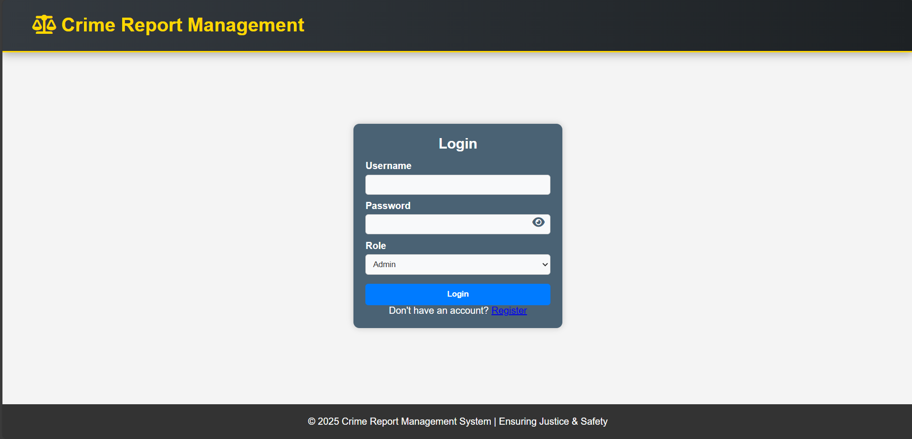
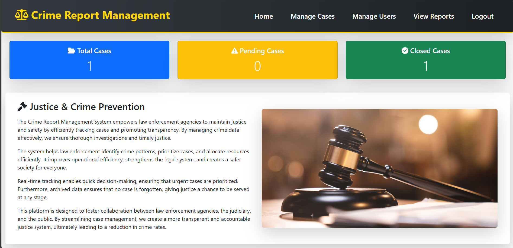
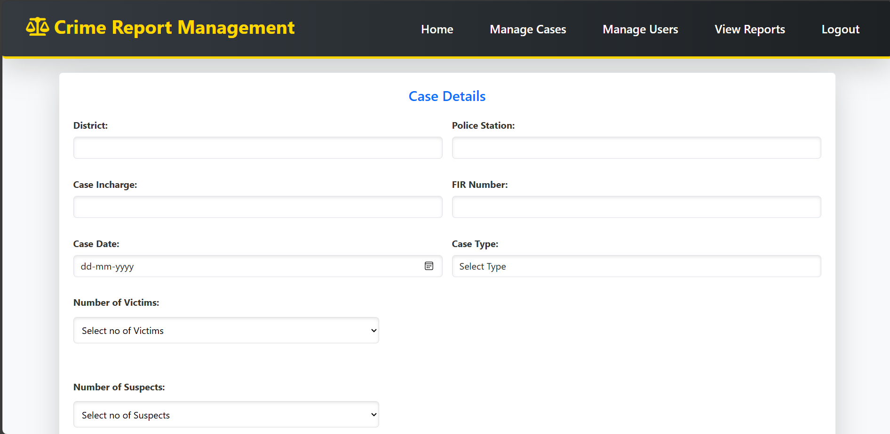
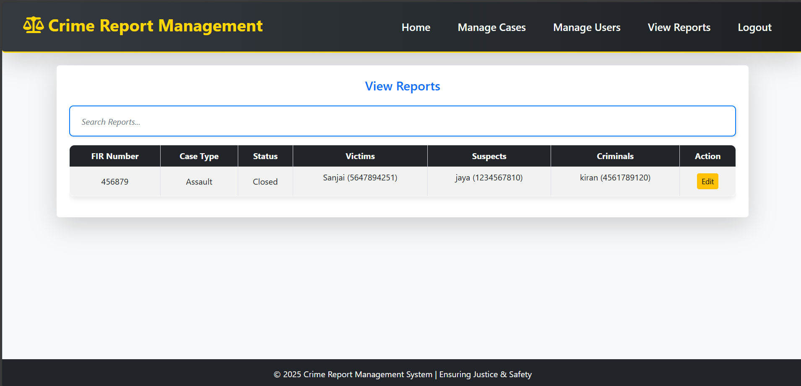

# Crime Report Management System

Crime Report Management System is a comprehensive web-based application built using Flask and MySQL. It provides a centralized platform for law enforcement agencies, administrative staff, and public users to manage and track criminal cases effectively. With role-based access control, intuitive interfaces, and secure authentication, this system promotes transparency, accountability, and efficiency in crime data management.

---

## 🚀 Features

### 🔐 Role-Based Access

* **Admin**

  * Full access to all system functionalities.
  * Manage users and their roles.
  * View and edit all cases.
  * Dashboard with case statistics (Total, Pending, Closed).
* **Police**

  * View and update case details relevant to their role.
  * Access to victims, suspects, and criminal data.
* **Public User**

  * Register and log in to view general crime statistics.
  * Submit personal and demographic information securely.

### 🗃️ Case Management

* Add and manage detailed case information:

  * District, Police Station, FIR Number
  * Incharge Officer, Case Overview, Judgment
  * Victim, Suspect, and Criminal details
* Upload and manage FIR documents
* Update case status (Pending/Closed)

### 🧾 Reports and Statistics

* Admins can view dynamic dashboards summarizing:

  * Total number of cases
  * Pending and Closed case counts
* Filter and search functionality for efficient navigation

### 🛡️ Secure Authentication

* Passwords are encrypted using bcrypt.
* Role-specific registration with validation (e.g., Aadhaar for public users, Police ID for officers)

### 📱 Responsive User Interface

* Built with HTML5, CSS3, and Bootstrap
* Mobile-friendly design with intuitive navigation

---

## 🧰 Tech Stack

* **Frontend**: HTML5, CSS3, Bootstrap, JavaScript
* **Backend**: Python (Flask Framework)
* **Database**: MySQL with PyMySQL
* **Security**: bcrypt for password hashing

---

## ⚙️ Setup Instructions

### 1. Clone the Repository

```bash
git clone https://github.com/yourusername/crime-report-management.git
cd crime-report-management
```

### 2. Create a Virtual Environment (Optional but Recommended)

```bash
python -m venv venv
source venv/bin/activate  # On Windows use venv\Scripts\activate
```

### 3. Install Dependencies

```bash
pip install -r requirements.txt
```

### 4. Configure the Database

* Make sure MySQL is installed and running
* Create a database named `crime_records`
* Update credentials in `database.py` if necessary

### 5. Initialize the Database

```bash
python modules.py  # Creates tables and default admin user
```

### 6. Run the Application

```bash
python app.py
```

* Open your browser and go to: `http://127.0.0.1:5000`

---

## 👤 Default Admin Login

```
Username: admin
Password: admin123
```

---

## 📸 Screenshots

### 🔐 Login Page


### 📊 Admin Dashboard


### 📝 Case Management Form


### 📄 Reports View


---

## 📁 Project Structure

```
crime-report-management/
├── app.py                # Main application script
├── modules.py            # Table creation and admin setup
├── database.py           # DB connection setup
├── templates/            # HTML templates (Jinja2)
├── static/               # CSS and uploads
├── README.md             # Project documentation
└── requirements.txt      # Python dependencies
```

---

## 📝 License

This project is licensed under the [MIT License](LICENSE).

---

## 🤝 Contributing

Contributions are welcome! Please fork the repo and submit a pull request. For major changes, open an issue first to discuss what you would like to change.

---

## 📬 Contact

If you have any questions or suggestions, feel free to contact the project maintainer via GitHub Issues or pull requests.

---

> Developed as a part of an initiative to modernize and digitize crime record handling and public reporting systems.
